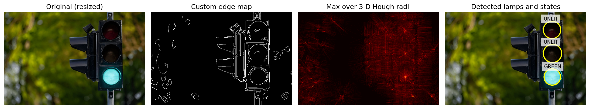
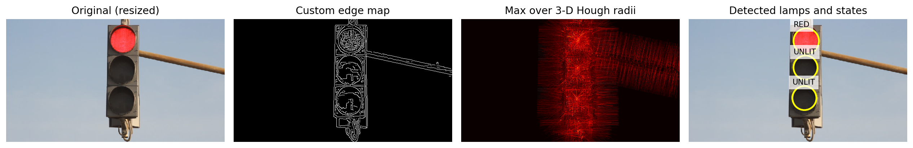
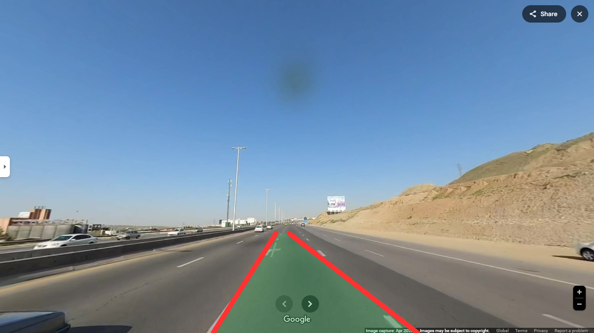
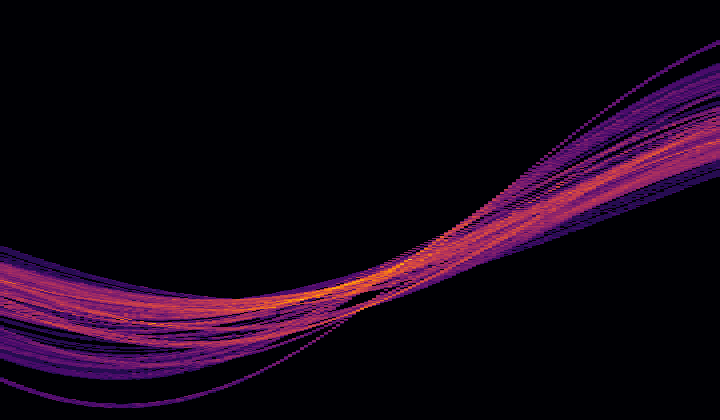
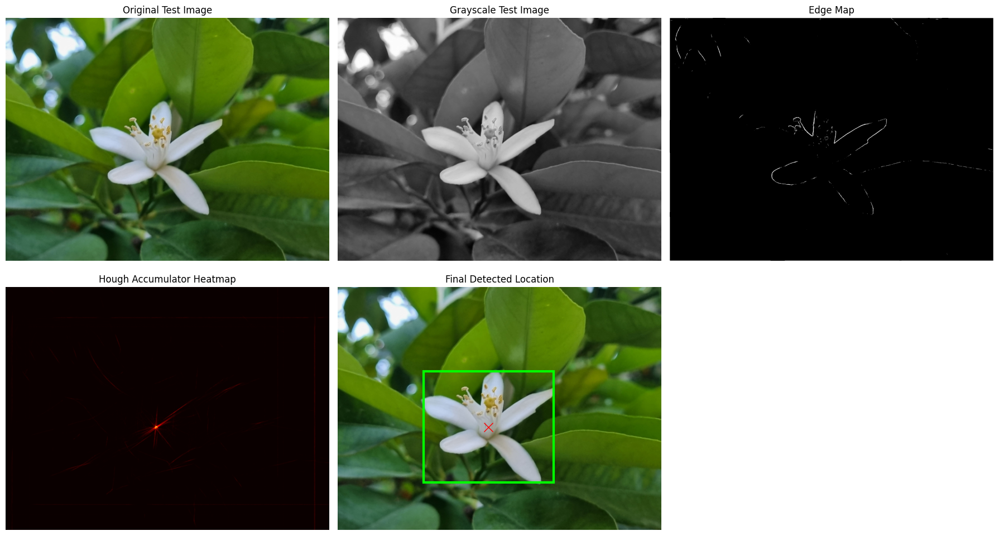
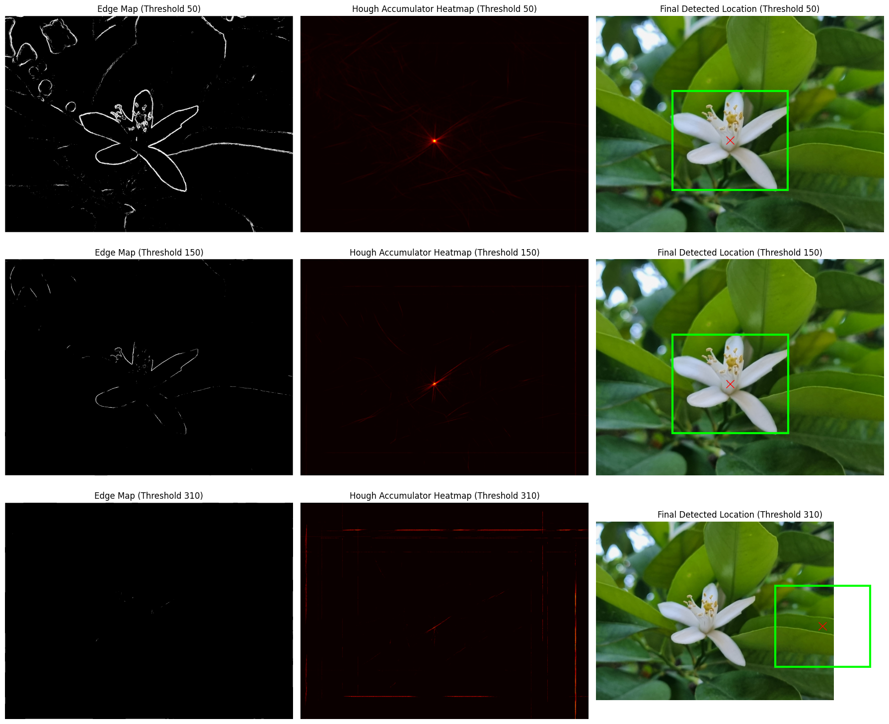

# Classical Computer Vision with From-Scratch Hough Transforms

## Overview

This repository contains a classical computer vision project for Digital Image Processing Homework 3. The project implements Hough-transform-based methods from scratch for three image-processing tasks:

- Traffic light detection and lamp-state classification using a gradient-guided 3-D Hough Circle Transform.
- Autonomous lane detection using a custom edge detector and polar Hough Line Transform.
- Real object localization using the Generalized Hough Transform with an R-Table.

The project is not a machine learning or deep learning project. It is a digital image processing and classical computer vision project built around custom NumPy implementations of filtering, edge detection, Hough voting, post-processing, profiling, and visualization.

## Key Features

- Implements Gaussian smoothing, Sobel-style gradients, non-maximum suppression, and hysteresis thresholding without built-in edge detectors.
- Uses gradient direction to reduce Hough circle voting from a brute-force angular sweep to two center votes per edge point and candidate radius.
- Detects traffic-light lamps and classifies each lamp as `RED`, `YELLOW`, `GREEN`, or `UNLIT`.
- Processes 23 road frames, detects left/right ego-lane boundaries, saves overlays, Hough heatmaps, edge maps, timing data, and a GIF.
- Implements Generalized Hough Transform object localization with template R-Table construction and vectorized accumulator voting.
- Includes an academic report PDF and saved visual outputs for GitHub presentation.

## Project Highlights

- Built a from-scratch Hough Transform workflow for circles, lines, and arbitrary object shapes.
- Used NumPy vectorization, broadcasting, boolean masks, `np.bincount`, and `np.add.at` to reduce Python pixel-loop overhead.
- Produced step-by-step diagnostic visualizations: original image, edge map, Hough accumulator, and final overlay.
- Added execution profiling for major stages such as preprocessing, edge detection, Hough voting, and post-processing.
- Organized the project around reproducible local input folders and saved result folders.

## Dataset

The dataset is a local/custom image dataset included in the repository under `images/`. The assignment PDF states that all required image datasets are located in the `images/` directory. No external dataset source link is specified in the current project files.

| Subset | Path | Type | Input | Target / Output |
| --- | --- | --- | --- | --- |
| Traffic lights | `images/traffic_lights/` | RGB traffic-light images | 3 images | Detected lamp circles and lamp states |
| Lane detection | `images/line_detection/` | Road image sequence | 23 numbered frames | Left/right lane overlays and animated GIF |
| Object localization | `images/object_localization/` | Template/test flower images | Grayscale template, grayscale test image, color test image | Estimated flower center and bounding box |

Dataset details:

- Dataset name: Not specified in the current project files.
- Dataset source: Local assignment-provided files in `images/`.
- Dataset structure: Three task-specific image folders.
- Features/columns: Image pixels only. There are no tabular feature columns.
- Labels/targets: No ground-truth annotation files are included. Labels and locations are generated by the implemented algorithms.
- Input format: Image files in local folders. Some files have `.png` names while the underlying encoding may vary; the code reads them through ImageIO or OpenCV.
- Output format: PNG visualizations, GIF animation, CSV timing report, notebook output tables, and PDF report.
- Train/test split: Not used.
- Missing value handling: Not applicable for image files.
- Normalization/scaling: Images are converted to grayscale or RGB float arrays as needed; Part 1 resizes large images to a bounded working scale.
- Data augmentation: Not used.

### Preprocessing Summary

- Traffic lights: RGB loading, resizing, luminance grayscale conversion, Gaussian smoothing, Sobel gradients, non-maximum suppression, double thresholding, and hysteresis.
- Lane detection: White/yellow lane-color thresholding, trapezoidal region-of-interest masking, custom Gaussian smoothing, Sobel gradients, edge thinning, and hysteresis.
- Object localization: Grayscale conversion, Sobel gradients, edge-threshold selection, gradient-angle binning, and R-Table construction from the flower template.

## Project Structure

```text
HW3/
|-- DIP-HW3.pdf
|-- Digital Image Processing Homework 3.pdf
|-- DIP-HW3.zip
|-- Part 1.ipynb
|-- part2.ipynb
|-- Part 3.ipynb
|-- part2_lane_detection.py
|-- part2_lane_detection_bottom.py
|-- images/
|   |-- traffic_lights/
|   |-- line_detection/
|   `-- object_localization/
|-- report_figures/
|   |-- green_light_1_steps.png
|   |-- red_light_1_steps.png
|   `-- red_light_2_steps.png
|-- results/
|   `-- line_detection/
|       |-- accumulators/
|       |-- edges/
|       |-- frames/
|       |-- preprocessed/
|       |-- lane_detection.gif
|       `-- timings.csv
|-- task3_combined_results.png
|-- threshold_comparison_results.png
|-- requirements.txt
|-- .gitignore
`-- README.md
```

Important files and folders:

- `DIP-HW3.pdf`: Original homework specification.
- `Digital Image Processing Homework 3.pdf`: Academic report describing methodology, timing, results, and conclusions.
- `Part 1.ipynb`: Traffic light detection and state-classification notebook.
- `part2.ipynb`: Lane detection notebook version.
- `Part 3.ipynb`: Generalized Hough Transform object-localization notebook.
- `part2_lane_detection.py`: Command-line lane detection pipeline.
- `part2_lane_detection_bottom.py`: Variant of the lane detection script that extends lane overlays to the bottom of the frame and adds a non-crossing lane safeguard.
- `images/`: Local task images used as input data.
- `report_figures/`: Saved Part 1 traffic-light step visualizations.
- `results/line_detection/`: Saved Part 2 intermediate outputs, overlays, GIF, and timing CSV.
- `task3_combined_results.png`: Saved Part 3 object-localization workflow visualization.
- `threshold_comparison_results.png`: Saved Part 3 threshold-sensitivity visualization.
- `DIP-HW3.zip`: Archive containing the assignment PDF and input images. The extracted files are already present in the repository.

## Methodology / Workflow

### Part 1: Traffic Light Detection

The traffic-light pipeline detects circular lamps and classifies their color state.

1. Load all images from `images/traffic_lights/`.
2. Resize each image to a bounded working scale.
3. Convert RGB to grayscale using luminance weighting.
4. Apply custom Gaussian smoothing and Sobel gradients.
5. Thin edges with non-maximum suppression.
6. Apply double thresholding and hysteresis.
7. Run a 3-D Hough Circle Transform over candidate radii.
8. Use gradient direction so each edge point votes along the positive and negative normal directions.
9. Normalize the accumulator, extract circle candidates, and suppress near-duplicates.
10. Select the best vertically aligned three-lamp traffic-light triplet.
11. Classify each lamp with brightness, saturation, and RGB dominance rules.
12. Save step figures in `report_figures/`.

### Part 2: Autonomous Lane Detection

The lane-detection pipeline processes a road-image sequence and exports visual results.

1. Load numbered PNG frames from `images/line_detection/`.
2. Isolate likely white and yellow lane-paint pixels.
3. Apply a trapezoidal road-region mask.
4. Run custom Gaussian smoothing, Sobel gradients, non-maximum suppression, and hysteresis.
5. Build a polar Hough accumulator over `(rho, theta)`.
6. Filter peaks by vote strength, slope, lane-side position, and image bounds.
7. Combine candidate lines into one left lane and one right lane using vote-weighted averaging.
8. Smooth lane endpoints across frames.
9. Draw red lane boundaries and a semi-transparent green lane polygon.
10. Save preprocessed frames, edge maps, Hough heatmaps, final overlays, `timings.csv`, and `lane_detection.gif`.

### Part 3: Generalized Hough Transform

The object-localization pipeline finds a flower in a test image using a template.

1. Load `template_flower_gray.png` and `test_flower_original.jpg`.
2. Convert the test image to grayscale.
3. Compute Sobel gradients and edge maps from scratch.
4. Select the template center as the reference point.
5. Build an R-Table by binning template edge orientations and storing displacement vectors to the reference point.
6. For each test edge pixel, retrieve matching R-Table vectors and vote in a 2-D accumulator.
7. Select the strongest accumulator peak as the estimated object center.
8. Draw the estimated flower center and bounding box on the original image.
9. Compare edge thresholds `50`, `150`, and `310` to show threshold sensitivity.

## Visual Results

### Traffic Light Detection



This figure shows the Part 1 pipeline for the green-light image: resized original, custom edge map, maximum Hough accumulator over radii, and final lamp classifications.



This figure shows the Part 1 pipeline for one red-light image, including the detected circles and `RED` / `UNLIT` lamp states.

### Lane Detection


The GIF shows the final lane overlay sequence generated from all 23 road frames at 2 FPS.



This frame shows the detected lane boundaries in red and the estimated drivable lane region in green.



This heatmap visualizes the polar Hough line accumulator for frame 1.

### Object Localization



This figure shows the Part 3 workflow: original test image, grayscale image, edge map, Hough accumulator heatmap, and final flower localization.



This figure compares edge thresholds `50`, `150`, and `310`. The middle threshold preserves enough flower structure while reducing background clutter.

## Installation

Python 3.10 or newer is recommended. The notebooks were saved with Python 3.x kernels, and the scripts use modern Python type annotations.

```bash
python3 -m venv venv
source venv/bin/activate
pip install -r requirements.txt
```

On Windows, activate the environment with:

```bash
venv\Scripts\activate
```

On Windows, use `python` instead of `python3` if that is how Python is installed.

## Usage

### Run the Notebooks

Use Jupyter to run each notebook interactively:

```bash
jupyter notebook "Part 1.ipynb"
jupyter notebook part2.ipynb
jupyter notebook "Part 3.ipynb"
```

The notebooks contain the Part 1, Part 2, and Part 3 workflows, respectively.

### Run Lane Detection from the Command Line

Run the default Part 2 script:

```bash
python3 part2_lane_detection.py
```

Run a short debug pass on only three frames:

```bash
python3 part2_lane_detection.py --max-images 3 --output-dir results/line_detection_debug
```

Run the bottom-extended lane overlay variant:

```bash
python3 part2_lane_detection_bottom.py --output-dir results/line_detection_bottom
```

Common command-line arguments:

| Argument | Default | Description |
| --- | --- | --- |
| `--input-dir` | `images/line_detection` | Folder containing numbered road frames |
| `--output-dir` | `results/line_detection` | Folder where outputs are written |
| `--fps` | `2.0` | GIF frame rate |
| `--max-edge-points` | `14000` | Caps edge points used for Hough voting |
| `--max-images` | `0` | Optional debug limit; `0` processes all frames |

## Training / Running the Project

There is no model training step. The project uses deterministic image-processing algorithms and local image inputs.

Typical full run:

1. Open and run `Part 1.ipynb` to generate traffic-light detections and `report_figures/`.
2. Run `python3 part2_lane_detection.py` or execute `part2.ipynb` to regenerate `results/line_detection/`.
3. Open and run `Part 3.ipynb` to reproduce object-localization figures.

## Evaluation

No ground-truth annotation files are included, so evaluation is based on visual inspection, generated overlays, and execution profiling rather than supervised accuracy metrics.

Part 1 notebook output reports these detected lamp states:

| Image | Lamp order | Center x | Center y | Radius | State |
| --- | ---: | ---: | ---: | ---: | --- |
| `green_light_1` | 1 | 454 | 76 | 37 | `UNLIT` |
| `green_light_1` | 2 | 456 | 177 | 39 | `UNLIT` |
| `green_light_1` | 3 | 455 | 278 | 35 | `GREEN` |
| `red_light_1` | 1 | 322 | 60 | 35 | `RED` |
| `red_light_1` | 2 | 320 | 133 | 33 | `UNLIT` |
| `red_light_1` | 3 | 317 | 217 | 33 | `UNLIT` |
| `red_light_2` | 1 | 406 | 133 | 25 | `RED` |
| `red_light_2` | 2 | 392 | 197 | 31 | `UNLIT` |
| `red_light_2` | 3 | 392 | 273 | 31 | `UNLIT` |

Part 1 notebook output reports an average total runtime of approximately `0.4037` seconds per image.

Part 2 timing data is saved in `results/line_detection/timings.csv`. The included CSV contains 23 frames with these averages:

| Stage | Average seconds per frame |
| --- | ---: |
| Preprocessing | 0.1321 |
| Edge detection | 0.1214 |
| Hough voting | 0.0092 |
| Post-processing | 0.0093 |
| Total | 0.3524 |

Part 3 notebook output reports the estimated flower center at approximately `(x=953, y=884)` in the test image.

## Results

Generated and included outputs:

- `report_figures/green_light_1_steps.png`
- `report_figures/red_light_1_steps.png`
- `report_figures/red_light_2_steps.png`
- `results/line_detection/preprocessed/*.png`
- `results/line_detection/edges/*.png`
- `results/line_detection/accumulators/*.png`
- `results/line_detection/frames/*.png`
- `results/line_detection/lane_detection.gif`
- `results/line_detection/timings.csv`
- `task3_combined_results.png`
- `threshold_comparison_results.png`

No trained model files or checkpoints are included because the project does not train a model.

## Requirements

The main Python dependencies are listed in `requirements.txt`:

- NumPy
- Pandas
- Matplotlib
- ImageIO
- OpenCV
- Pillow
- Jupyter

## Technologies Used

- Python
- NumPy
- Pandas
- Matplotlib
- ImageIO
- OpenCV
- Pillow
- Jupyter Notebook

## Future Improvements

- Add standalone command-line scripts for Part 1 and Part 3, matching the existing Part 2 script.
- Save Part 3 generated figures automatically into a dedicated folder such as `results/object_localization/`.
- Add ground-truth annotations for quantitative metrics such as localization error and detection accuracy.
- Add automated tests for core functions such as convolution, edge detection, Hough voting, and peak selection.
- Move configurable thresholds and hyperparameters into a configuration file.
- Pin dependency versions after confirming the target Python version and runtime environment.
- Add a small `src/` package structure if the project grows beyond homework notebooks and scripts.

## References

- [`DIP-HW3.pdf`](DIP-HW3.pdf): Homework specification.
- [`Digital Image Processing Homework 3.pdf`](Digital%20Image%20Processing%20Homework%203.pdf): Included academic report with methodology, profiling, results, and conclusions.

No external dataset link is specified in the current project files.

## License

No license file is currently included in this repository. Add a license before publishing if you want to define usage permissions.
